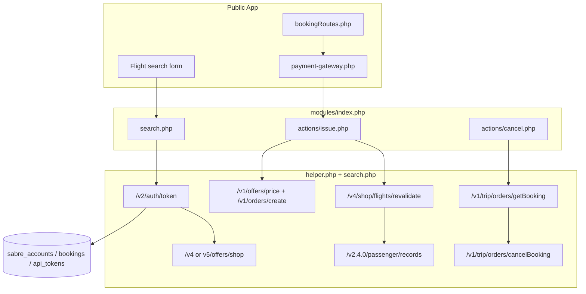

# Iati_new Master Audit (Read-Only)

**Audit date:** 2026-06-08  
**Reference project:** `C:\Users\khadi\ota\Binham\Iati_new`  
**Scope:** Sabre integration, search/BFM, normalization, revalidation, booking/PNR, cancellation, refund, email, diagnostics, security  
**Mode:** Read-only — no live API calls, no code changes

---

## Executive Summary

`Iati_new` is a **custom PHP 8.2 + Medoo** travel platform (not Laravel) with a dual-entry architecture: public web app (`index.php`) and supplier API gateway (`modules/index.php`). Sabre logic is concentrated in `modules/flights/sabre/helper.php` (~6.6k lines) and `modules/flights/sabre/search.php` (~2.1k lines).

**Maturity:** Production-capable for GDS + NDC search, checkout revalidation, GDS CPNR and NDC order creation, getBooking sync, and cancelBooking HTTP — but with **significant security and maintainability debt** (web-accessible debug files, inconsistent redaction, monolithic helper, legacy credential fallback).

**Secondary codebase:** `jet.iati.pk/` is a separate Laravel app with its own Sabre references (older parallel stack). This audit focuses on the main `Iati_new` tree.

---

## Phase 1 — Project Structure Map

### Framework & Language

| Item | Evidence |
|------|----------|
| PHP ≥ 8.2 | `composer.json` |
| ORM | Medoo (`catfan/medoo`) |
| Router | `qaxim/php-router` |
| Mail | PHPMailer + Postmark/SMTP plugins |
| Frontend | PHP views, Tailwind, Alpine.js |

### Main Entry Points

| Path | Role |
|------|------|
| `index.php` | Public web — loads `config.php`, `app/routes/_routes.php`, dispatches router |
| `modules/index.php` | Supplier API gateway — rate limiting, lazy module load, CORS `*` |
| `config.php` | Bootstrap (DB, globals) |
| `diagnostic.php` | **Public Sabre auth/search diagnostic** (Critical risk) |

### Routing Structure

**Web UI:** `app/routes/**/*.php` — flights, admin, users, API  
**Supplier modules:** `modules/flights/{supplier}/` — Sabre at `modules/flights/sabre/`

### Controllers / Actions by Domain

| Domain | Location | Key handlers |
|--------|----------|--------------|
| **Search** | `modules/flights/sabre/search.php` (self-executing on path match) | Multi-account BFM loop |
| **Results** | Inline normalization in `search.php` → JSON to frontend | No separate controller |
| **Revalidation** | `helper.php` — `SABRE_REVALIDATE_GDS_CHECKOUT()`, `SABRE_REVALIDATE_GDS_IMPORT_PREVIEW()` | Before checkout PNR |
| **Checkout** | `app/routes/flights/bookingRoutes.php`, `app/routes/api/flights/bookingRoutes.php` | Draft booking, passenger entry |
| **Booking/PNR** | `app/lib/flight-supplier-booking.php` → `SABRE_CREATE_PNR()` | `helper.php` |
| **Payment** | `app/lib/payment-gateway.php` | Auto-issue after wallet payment |
| **Cancellation** | `app/routes/flights/bookingRoutes.php` (request), `modules/flights/sabre/actions/cancel.php` | Portal + Sabre HTTP |
| **Refund** | `modules/flights/sabre/actions/refund.php` | **DB-only — no Sabre refund API** |
| **Ticketing** | Via payment gateway post-payment `SABRE_CREATE_PNR()` | No separate ticketing endpoint |
| **Emails** | `app/lib/notify.php` — `NOTIFY` class | `app/views/notifications/emails/flights/*` |
| **Admin booking** | `app/routes/admin/bookingsRoutes.php`, `app/routes/admin/sabreAccountsRoutes.php` | Import PNR, refresh, repricing |

### Sabre Service Files

| File | Purpose |
|------|---------|
| `modules/flights/sabre/helper.php` | Auth, revalidation, normalization, import, PNR create, status, remarks |
| `modules/flights/sabre/search.php` | BFM v4/v5 search, token cache, result normalization |
| `modules/flights/sabre/creds.php` | Credential test + service catalog |
| `modules/flights/sabre/actions/issue.php` | `POST flights/sabre/issue` → `SABRE_CREATE_PNR()` |
| `modules/flights/sabre/actions/cancel.php` | `POST flights/sabre/cancel` → cancelBooking |
| `modules/flights/sabre/actions/void.php` | Same cancelBooking endpoint |
| `modules/flights/sabre/actions/refund.php` | DB refund request logging only |
| `modules/flights/sabre/test_booking.php` | CLI diagnostic (hardcoded local DB creds) |

### Database Tables (Sabre-related)

| Table | Usage |
|-------|-------|
| `sabre_accounts` | Multi-account PCC/EPR/domain/password/env/type (GDS/NDC/BOTH) |
| `modules` | Legacy single Sabre config (`c1`–`c4`, `dev_mode`) |
| `bookings` | `invoice_id`, `pnr`, `booking_data` (JSON), `travellers`, `booking_response`, status |
| `logs_bookings` | Pre-checkout draft by hash |
| `logs_searches` | Search audit (inserted by `modules/index.php` on `*/search`) |
| `api_tokens` | Cached OAuth tokens per account key |
| `settings` | SMTP/email provider config |
| `notifications` | Event log via `triggerNotification()` |

### Data Flow Overview



---

## Phase 2 — Sabre/API Authentication Audit

| Project | File | Class/Function | Auth endpoint | Credential source | PCC source | Token storage | Retry behavior | Security risk | Notes |
|---------|------|----------------|---------------|-------------------|------------|---------------|----------------|---------------|-------|
| Iati_new | `search.php` | inline `$sabre_get_access_token` | `/v2/auth/token` | `sabre_accounts` or legacy `modules.c1–c4` | Account row `pcc`; POS `PseudoCityCode` | `api_tokens` table + in-request cache | Per-account loop; skip on auth fail | **Medium** | V1:EPR:PCC:domain + base64 password |
| Iati_new | `helper.php` | `SABRE_AUTHENTICATE_ACCOUNT()` | `/v2/auth/token` | `SABRE_BUILD_ACCOUNT_CONFIG()` from DB | Same as search | Fresh per call (no shared cache in helper) | Throws on fail | **Medium** | Used for booking/status/import |
| Iati_new | `actions/cancel.php` | inline curl | `/v2/auth/token` | **Legacy `modules` only** (not `sabre_accounts`) | `modules.c1` | None (per request) | None | **High** | Cancel may use wrong PCC vs booking account |
| Iati_new | `diagnostic.php` | root script | `/v2/auth/token` | `modules` table | Prints PCC to stdout | None | N/A | **Critical** | Publicly reachable if deployed |
| Iati_new | `test_booking.php` | CLI | `/v2/auth/token` | Hardcoded `root`/empty + `modules` | From modules | None | N/A | **High** | Local dev script in web tree |

### Credential Format

Pattern: `base64(base64("V1:{epr}:{pcc}:{domain}") + ":" + base64(password))`  
Used in: `search.php` L514–516, `helper.php` L5084–5087, `cancel.php` L145–149

### Environment Switching

- `env === 'test'` → `https://api.cert.platform.sabre.com`
- else → `https://api.platform.sabre.com`
- Multi-account: loops all active `sabre_accounts` with airline include/exclude rules

### Hardcoded / Exposed Secrets (masked)

| Path | Variable/Key | Masked example | Risk |
|------|--------------|----------------|------|
| `test_booking.php` | `username` | `root` | High |
| `test_booking.php` | `password` | `****` (empty) | High |
| `helper.php` | `iataNumber` | `27325406` | Informational (business ID) |
| `helper.php` | agency `name` | `BINHAM TRAVEL SERVI` | Informational |
| DB `sabre_accounts.password` | runtime | `****` | Medium if DB compromised |
| DB `api_tokens.token` | OAuth bearer | `eyJh****xyz` | High if table exposed |

---

## Phase 3 — BFM / Search

### Endpoints Identified

| Endpoint | When used | File |
|----------|-----------|------|
| `/v4/offers/shop` | Account `type === 'GDS'` | `search.php` L538–540 |
| `/v5/offers/shop` | Account `type === 'NDC'` or `'BOTH'` | `search.php` L538–540 |
| `/v4/shop/flights?async=false` | Legacy: `diagnostic.php`, `test_booking.php` | Diagnostic only |
| `/v4/shop/flights/revalidate` | Checkout + import repricing | `helper.php` |

### BFM Selector Logic (`search.php` L537–618)

```php
$isNdcEnabled = ($acc['type'] === 'NDC' || $acc['type'] === 'BOTH');
$shopVersion = $isNdcEnabled ? '5' : '4';
$shopEndpoint = $base_endpoint . "/v{$shopVersion}/offers/shop";
```

**DataSources (TPA_Extensions):**
- NDC: Enable for NDC/BOTH; Disable for pure GDS
- ATPCO/LCC: Enable for GDS/BOTH; Disable for pure NDC
- NDC-only: `NDCIndicators`, `PreferNDCSourceOnTie`

**Search parameters:** origin/destination, dates, multicity slices, cabin class map, direct flights flag, currency, `RequestType` = `100ITINS`, branded fare indicators, passenger ADT/CNN/INF counts.

**No BFM version fallback:** If v5 fails for NDC account, account is skipped (continue loop); no automatic downgrade to v4.

### Response Parsing

- Parses `groupedItineraryResponse` → `itineraryGroups`, `scheduleDescs`, `legDescs`, `fareBrandDescs`, `fareComponentDescs`, `priceClassDescriptions`
- Inline closures for brand meta, carrier extraction, markup application
- Results deduplicated and merged across accounts
- `booking_data` nested on each result/segment for downstream PNR

### Cache / Storage

- OAuth: `api_tokens` with key pattern `sabre_{accountId}_{pcc}_{env}`
- Search results: returned to client; pre-checkout draft in `logs_bookings` by hash
- Debug: `uploads/sabre_debug.txt` (opt-in via `SABRE_SEARCH_DEBUG` or `?sabre_debug=1`)

---

## Phase 4 — Normalization

### Normalized Result Schema (Iati_new)

Results are **associative arrays** (not typed DTOs), built inline in `search.php`. Key fields preserved:

| Field area | Preserved in Iati_new | Location |
|------------|----------------------|----------|
| Itinerary refs | leg refs, schedule refs, pricing index | `booking_data` on result |
| Carriers | marketing, operating, validating | Segment + itinerary level |
| RBD / fare basis | Per segment in `booking_data` | `search.php` normalization loop |
| Brand / baggage | `fareBrandDescs`, benefits, refundable flag | Brand resolver closures |
| Pricing | base, tax, total, currency, per-pax | `pricingInformation` index |
| Account context | `account_id`, PCC, env, type | `booking_data` |
| Distribution | GDS vs NDC inferred from account type + offer shape | Partial — account-driven |
| Raw linkage | Full `booking_data` JSON stored in `bookings.booking_data` | Checkout |

**Gaps:**
- No canonical typed schema; shape varies by trip type (OW/RT/MC)
- Round-trip layover/duration: computed inline; **Needs manual confirmation** for edge cases
- No explicit `sabre_bfm_gir_archive` — relies on reconstructed `booking_data`
- Frontend card fields used as booking authority at checkout (hidden JSON round-trip)

### Import Normalization (`helper.php`)

| Function | Purpose |
|----------|---------|
| `SABRE_NORMALIZE_GDS_IMPORT()` | getBooking → import preview |
| `SABRE_NORMALIZE_NDC_IMPORT()` | NDC order view → import preview |
| `SABRE_APPLY_REVALIDATED_GDS_PRICE()` | Apply repriced totals |
| `SABRE_CLASSIFY_BOOKING_SOURCE()` | GDS vs NDC |

---

## Phase 5 — Revalidation

### Endpoints

| Endpoint | Function | When |
|----------|----------|------|
| `/v4/shop/flights/revalidate` | `SABRE_REVALIDATE_GDS_CHECKOUT()` | Before PNR create (GDS checkout) |
| `/v4/shop/flights/revalidate` | `SABRE_REVALIDATE_GDS_IMPORT_PREVIEW()` | Admin/agent import repricing |
| `/v1/offers/repriceOrder` | `SABRE_REPRICE_NDC_IMPORT_PREVIEW()` | NDC import |

### Payload Source

- Checkout: `booking_data` / `flight_data` from DB + segment booking_data from search
- Segments built via `SABRE_BUILD_GDS_CHECKOUT_REVALIDATE_SEGMENTS()`
- **Not** from raw GIR archive — reconstructed from stored normalized data

### Failure Handling

| Condition | Behavior | File |
|-----------|----------|------|
| HTTP/auth fail | Exception → booking error_response stored | `helper.php` |
| Price change | `SABRE_APPLY_REVALIDATED_GDS_PRICE()` updates preview; `price_revalidated` flag | `helper.php` L1337+ |
| Stale / no fares | Logged; import preview may show unavailable | `helper.php` |
| Admin alert | Via `triggerNotification` on payment/issue paths | `payment-gateway.php` |

**Price change:** Applied to preview amounts; **Needs manual confirmation** whether customer must explicitly accept before payment on all paths.

---

## Phase 6 — Booking / PNR

### Endpoints

| Channel | Endpoint | Function |
|---------|----------|----------|
| GDS | `/v2.4.0/passenger/records?mode=create` | `SABRE_CREATE_PNR()` L5760 |
| NDC | `/v1/offers/price` then `/v1/orders/create` | `SABRE_CREATE_PNR()` |
| Retrieve | `/v1/trip/orders/getBooking` | `SABRE_GET_BOOKING_STATUS()`, cancel pre-check |
| NDC retrieve | `/v1/orders/view`, `/v1/ndc/orders/retrieve` | Fallback in status |

### Payload Builder Highlights (`SABRE_CREATE_PNR`)

- **AirBook** segments from stored flight data
- **AirPrice** with validating carrier, RBD, fare basis
- **HaltOnStatus:** HL, KK, LL, NO, UC, UN, US, UU (`helper.php` L5720)
- **EndTransaction**, **ReceivedFrom**, SSR/contact/email/phone
- Passenger names, DOB, gender, passport SSRs
- GDS revalidation result merged before CPNR when applicable

### Idempotency

- Returns early if `pnr` exists and `booking_status === 'confirmed'` (`helper.php` L5013–5020)
- Localhost block prevents accidental PNR (`helper.php` L5006–5010)
- **No** payment callback idempotency token visible in Sabre layer — **Needs manual confirmation** in payment gateway

### Host Status Classification (`helper.php`)

- Confirmed: HK, SS, RR, LK, PK (L2117, L6433)
- Cancelled: XX, HX, NO, UN, UC, US, UU, CANCELLED, CLOSED (L2115, L6435)

### PNR Storage

- `bookings.pnr`, `booking_ref`, `booking_response` (JSON), `booking_data`, `error_response`
- Status refresh via `SABRE_GET_BOOKING_STATUS()` on invoice view

---

## Phase 7 — Cancellation / Refund

### Cancellation Flow (`actions/cancel.php`)

1. Validate `invoice_id` from POST
2. Load booking from DB
3. Idempotent if already cancelled/voided
4. Local cancel if no PNR
5. Auth via **legacy `modules`** credentials (not booking's `sabre_accounts`)
6. Heuristic ticket check on `booking_response` JSON
7. `DELETE /v1/trip/orders/cancelBooking` with `{ confirmationId: pnr }`
8. Update DB status

**Gaps:**
- **No getBooking before cancel** — does not check `isCancelable`
- **No retrieve-after-cancel** verification
- Ticketed vs unticketed: note in error message only; same cancel payload
- Uses legacy module PCC — may mismatch booking account

### Refund (`actions/refund.php`)

- **No Sabre refund/void API call**
- Updates DB with refund request fields
- Documents manual Red Workspace processing

---

## Phase 8 — Email / Alerts

### Mechanism

| Component | Path |
|-----------|------|
| `NOTIFY` class | `app/lib/notify.php` |
| `SENDEMAIL()` | `app/lib/functions.php` |
| SMTP | `app/lib/notifications/email/smtp.php` |
| Postmark | `app/lib/notifications/email/postmark.php` |
| Config | `settings.email_providers_config` (DB) |

### Templates

| Template | Path |
|----------|------|
| Booking confirmation | `app/views/notifications/emails/flights/booking.php` |
| Booking PDF | `app/views/notifications/emails/flights/booking_pdf.php` |
| Cancellation | `app/views/notifications/emails/flights/booking_cancellation.php` |
| Itinerary helpers | `app/views/notifications/emails/flights/itinerary_helpers.php` |

### Triggers

| Event | Trigger location |
|-------|------------------|
| `booking.payment_received` | `payment-gateway.php` |
| `booking.issued` / `booking.issue_failed` | `payment-gateway.php` (post Sabre issue) |
| `booking.issue_exception` | `payment-gateway.php` |
| Cancellation | `NOTIFY::cancellation()` — `bookingRoutes.php` |
| Resend | `NOTIFY::resend()` — `bookingRoutes.php` |

**Queue:** Synchronous (no queue abstraction observed).  
**Sensitive data risk:** Templates may include PNR, passenger names, routes — standard for confirmations; debug paths riskier.

---

## Phase 9 — Logging / Debugging

| Surface | Risk | Evidence |
|---------|------|----------|
| `uploads/sabre_booking_debug.txt` | **Critical** | Full PNR payloads, PCC, EPR |
| `uploads/sabre_status_debug.txt` | **High** | Plain-text PCC/EPR |
| `uploads/sabre_import_debug.txt` | **High** | Raw import responses |
| `uploads/sabre_debug.txt` | **High** | Search opt-in debug |
| `diagnostic.php` | **Critical** | Public auth + PCC print |
| `search.php` display_errors | **High** | Returns file/line in JSON errors |
| `SABRE_REDACT_DEBUG_PAYLOAD()` | Partial mitigation | Not applied everywhere |
| `api_tokens` table | **High** | Live bearer tokens in DB |

### Admin Diagnostics

- Admin import PNR UI: `app/views/admin/sabre/import-pnr.php`
- Sabre account CRUD: `app/routes/admin/sabreAccountsRoutes.php`
- Repricing actions on admin bookings routes
- No structured `safe_summary` taxonomy — raw logs predominate

---

## Phase 10 — Security Risk Register (Iati_new)

| Risk | File | Severity | Evidence | Impact |
|------|------|----------|----------|--------|
| Public diagnostic endpoint | `diagnostic.php` | **Critical** | Prints PCC, runs live auth | Credential/context exposure |
| Web-writable debug logs | `uploads/sabre_*.txt` | **Critical** | PNR/PII in plaintext files | Data breach if web-accessible |
| CORS `*` on supplier API | `modules/index.php` | **High** | Open cross-origin | CSRF-like abuse from browsers |
| Cancel uses wrong credential source | `actions/cancel.php` | **High** | `modules` not `sabre_accounts` | Cancel against wrong PCC |
| Cancel without retrieve/eligibility | `actions/cancel.php` | **High** | Direct cancelBooking | Failed cancels, ticketed mishandling |
| Search error leaks paths | `search.php` | **Medium** | `display_errors`, file/line in JSON | Info disclosure |
| OAuth tokens in DB | `api_tokens` | **Medium** | Unencrypted bearer tokens | Token theft if DB leaked |
| `test_booking.php` in web tree | `test_booking.php` | **High** | Hardcoded DB creds | Local/dev exposure |
| `issue.php` returns full result | `actions/issue.php` | **Medium** | Internal supplier response echoed | API data leakage |
| Inconsistent payload redaction | `helper.php` | **Medium** | Some logs unredacted | PII in logs |
| Frontend booking authority | `bookingRoutes.php` | **Medium** | `booking_data` from client round-trip | Tampered offer risk if not revalidated |

---

## File-by-File Appendix (Key Files)

| Path | Purpose | Key functions | Endpoints | Risk notes |
|------|---------|---------------|-----------|------------|
| `modules/flights/sabre/helper.php` | Core Sabre integration | `SABRE_CREATE_PNR`, `SABRE_REVALIDATE_GDS_CHECKOUT`, `SABRE_GET_BOOKING_STATUS`, `SABRE_NORMALIZE_GDS_IMPORT` | auth, revalidate, PNR, getBooking, NDC | Monolith; inconsistent redaction |
| `modules/flights/sabre/search.php` | BFM search | inline normalize, `$sabre_get_access_token` | v4/v5 offers/shop | display_errors; debug files |
| `modules/flights/sabre/actions/cancel.php` | Cancel API route | inline curl | cancelBooking | No retrieve; wrong cred source |
| `modules/flights/sabre/actions/refund.php` | Refund route | DB update only | none | Manual workflow only |
| `app/lib/flight-supplier-booking.php` | Checkout → PNR | `FLIGHTS_SUPPLIER_BOOKING_SUBMIT` | via helper | Production booking entry |
| `app/lib/payment-gateway.php` | Payment + auto-issue | `triggerNotification` | via issue | Auto PNR after payment |
| `app/lib/notify.php` | Email orchestration | `NOTIFY::booking`, `::cancellation` | N/A | Sync send |
| `diagnostic.php` | Sabre diagnostic | root script | auth + legacy shop | **Remove from production** |
| `app/routes/admin/sabreAccountsRoutes.php` | Multi-account admin | CRUD | N/A | Password stored in DB |

---

## Uncertainties (Needs Manual Confirmation)

1. Whether production `.htaccess` blocks `diagnostic.php`, `uploads/*.txt`, and `test_booking.php`
2. Customer fare-acceptance UX on all revalidation price-change paths
3. Payment callback duplicate-booking protection in `payment-gateway.php`
4. Round-trip layover accuracy for complex married segments
5. Whether `jet.iati.pk` Laravel app is still deployed alongside main app

---

*End of Iati_new master audit.*
