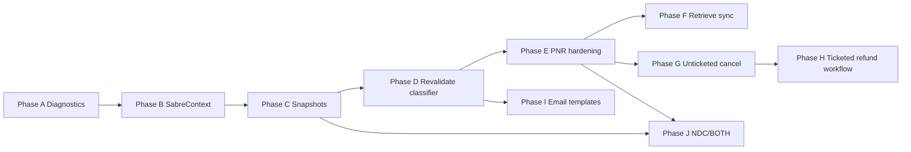

# Iati vs OTA Implementation Roadmap

**Audit date:** 2026-06-08  
**Purpose:** Safe sprints to exceed Iati Sabre functionality without copying unsafe patterns  
**Prerequisite:** Read-only audits in sibling docs; no production code changed by this document

---

## Roadmap Principles

1. **Never copy** `diagnostic.php`, `uploads/sabre_*.txt` debug pattern, or unauthenticated supplier routes
2. **Gate every live HTTP** behind env + platform module + eligibility classifiers
3. **Retrieve before destructive actions** (cancel, void)
4. **Canonical snapshots** — booking authority from server snapshots, not frontend cards
5. **One certified path per itinerary** in public checkout (`SabreCertifiedRouteSelector`)

---

## Phase A — Read-Only Diagnostics Hardening

| Item | Detail |
|------|--------|
| **Objective** | Ensure admin/staff see safe supplier diagnostics without raw payloads |
| **Why needed** | Iati relies on web debug files; OTA must stay Artisan/DB-summary based |
| **Risk level** | Low |
| **Files likely to inspect/edit** | `SupplierDiagnosticLogger.php`, `AdminSectionController.php`, `BookingManagementController::buildSabrePnrReadinessPanel()`, `resources/views/admin/reports/supplier-diagnostics.blade.php` |
| **Test commands** | `php artisan test --filter=SupplierDiagnostic`, `php artisan sabre:inspect-booking-config` |
| **Rollback** | Revert view/controller changes only |
| **Production safety** | Read-only UI changes; no supplier HTTP |

**Deliverables:**
- Map all `safe_summary_category` values to admin UI labels
- Verify no raw `supplier_response` in booking show blades
- Document inspect command catalog for ops runbook

---

## Phase B — SabreContext / PCC Consistency

| Item | Detail |
|------|--------|
| **Objective** | Single immutable context object: connection, env, PCC, shop version, distribution channel |
| **Why needed** | Iati cancel uses wrong PCC source; multi-account search handoff is fragile |
| **Risk level** | Medium |
| **Files likely to inspect/edit** | New `app/Data/SabreContextData.php` or `app/Support/Suppliers/SabreContext.php`, `SabreFlightSearchRequestBuilder.php`, `SabreBookingService.php`, `SabreClient.php`, `NormalizedFlightOfferData` handoff |
| **Test commands** | `php artisan test --filter=SabreContext`, `php artisan sabre:inspect-shop-payload` |
| **Rollback** | Feature flag `SABRE_CONTEXT_V1_ENABLED=false` |
| **Production safety** | No live booking changes if context is read-only metadata first |

**Deliverables:**
- `SabreContext` built at search time from `SupplierConnection`
- Persisted on `Booking.meta.sabre_context`
- Cancel/PNR always use booking's connection (never global default)

---

## Phase C — Normalization and Booking Snapshot Hardening

| Item | Detail |
|------|--------|
| **Objective** | Freeze canonical offer + `sabre_shop_context` + `sabre_bfm_gir_archive` at selection/checkout |
| **Why needed** | Iati trusts round-tripped `booking_data`; OTA must formalize snapshot |
| **Risk level** | Medium |
| **Files likely to inspect/edit** | `SabreFlightSearchNormalizer.php`, `BookingController.php`, `OfferValidationService.php`, `Booking` model meta accessors |
| **Test commands** | `php artisan test --filter=NormalizedFlightOffer`, `php artisan test --filter=BookingSnapshot` |
| **Rollback** | Keep legacy meta keys readable for in-flight bookings |
| **Production safety** | Snapshot write only; no new Sabre HTTP |

**Deliverables:**
- `booking_snapshot` schema documented in `summary.md`
- Validation rejects offers missing `leg_refs`, `schedule_refs`, `pricing_information_index` for GDS revalidate path
- Brand/baggage parity review vs Iati `search.php` brand resolver

---

## Phase D — Revalidation Failure Classifier

| Item | Detail |
|------|--------|
| **Objective** | Unified classifier for revalidate/refresh failures → customer message + admin alert |
| **Why needed** | Iati logs to files; OTA needs structured `REVALIDATION_STALE`, `PRICE_CHANGED`, etc. |
| **Risk level** | Medium |
| **Files likely to inspect/edit** | `SabreRevalidationPayloadBuilder.php`, `SabreBookingService::runRevalidationBeforeBooking()`, `SabreBookingOfferRefreshService.php`, `SabrePnrFailureClassifier.php` (extend), `OtaNotificationEvent` |
| **Test commands** | `php artisan sabre:cert-gds-revalidate-report`, `php artisan test --filter=Revalidat` |
| **Rollback** | `SABRE_REVALIDATE_BEFORE_BOOKING=false` temporarily |
| **Production safety** | Classifier can ship before enabling new live paths |

**Deliverables:**
- Failure matrix implemented in code (not docs only)
- Customer-safe strings for unavailable / price changed / stale
- Admin alert on `SupplierReadinessFailed`

---

## Phase E — PNR Create Payload Hardening

| Item | Detail |
|------|--------|
| **Objective** | Certify OW-direct GDS CPNR v2.5 (and optional IATI v2.4 style) with HaltOnStatus + fresh-shop guard |
| **Why needed** | Iati runs live v2.4 CPNR in production; OTA needs parity with more guards |
| **Risk level** | **High** |
| **Files likely to inspect/edit** | `SabreBookingPayloadBuilder.php`, `SabreBookingService.php`, `SabreBookingClient.php`, `SabreSegmentFreshShopSellabilityService.php`, `config/suppliers.php` |
| **Test commands** | `php artisan sabre:cert-gds-cpnr-report`, `php artisan sabre:inspect-booking-payload`, `php artisan test --filter=SabreBooking` |
| **Rollback** | `SABRE_BOOKING_LIVE_CALL_ENABLED=false`; revert payload style env |
| **Production safety** | Enable live only after CERT matrix green; admin/staff first, then public OW-direct |

**Deliverables:**
- Documented certified route per `SabreCertifiedRouteSelector`
- Host status handling: UC/HL/NO → manual review (match Iati HaltOnStatus intent)
- No live multi-segment until `passenger_records_allow_verified_multi_segment=true` + verifier pass

---

## Phase F — Retrieve / Sync Enhancement

| Item | Detail |
|------|--------|
| **Objective** | Operational getBooking sync on schedule + post-PNR; segment status display |
| **Why needed** | Iati refreshes on invoice view; OTA has `SabrePnrItinerarySyncService` — extend ops UX |
| **Risk level** | Low–Medium |
| **Files likely to inspect/edit** | `SabrePnrItinerarySyncService.php`, `SabreTripOrdersGetBookingItineraryMapper.php`, `HandlesSabrePnrItinerarySync` trait, staff/admin booking show |
| **Test commands** | `php artisan sabre:sync-pnr-itinerary --dry-run`, `php artisan sabre:inspect-pnr-retrieve` |
| **Rollback** | Disable sync button; meta snapshot is additive |
| **Production safety** | getBooking is read-only; gate with `SABRE_PNR_RETRIEVE_INSPECT_ENABLED` / live retrieve flag |

**Deliverables:**
- HK/UC segment status in admin panel from `pnr_itinerary_snapshot`
- `PnrItinerarySynced` / `PnrItinerarySyncFailed` notifications wired
- No raw getBooking JSON in UI

---

## Phase G — Cancellation Unticketed PNR Flow

| Item | Detail |
|------|--------|
| **Objective** | Production cancel for **unticketed** GDS/Trip Orders bookings with retrieve → eligibility → cancel → retrieve |
| **Why needed** | Iati has live cancel but skips retrieve; OTA has inspect probes only |
| **Risk level** | **High** |
| **Files likely to inspect/edit** | `SabreBookingService::cancelBooking()`, `SabreCancelPayloadBuilder.php`, `SabreCancelBookingContext.php`, `BookingCancellationService::processCancellation()`, `config/suppliers.php` cancel flags |
| **Test commands** | `php artisan sabre:inspect-cancel-booking`, `php artisan test --filter=Cancel` |
| **Rollback** | `SABRE_CANCEL_LIVE_CALL_ENABLED=false`; portal manual cancel only |
| **Production safety** | Unticketed only; explicit prod confirm token; use booking's `SupplierConnection` |

**Recommended flow:**
```
CancelRequest → RetrieveLatestBooking → DetermineEligibility (isCancelable)
  → BuildCancelPayload → SubmitCancel → RetrieveAgain → UpdateLocalStatus
  → NotifyCustomer/Admin → AuditLog
```

**Do not copy from Iati:**
- Legacy `modules` credentials
- Cancel without retrieve
- Same payload for ticketed and unticketed

---

## Phase H — Ticketed Refund/Void Manual Workflow

| Item | Detail |
|------|--------|
| **Objective** | Staff workflow for ticketed cancellations: manual void/refund with finance ledger |
| **Why needed** | Both codebases lack safe automated Sabre refund API |
| **Risk level** | Medium |
| **Files likely to inspect/edit** | `BookingCancellationService.php`, `BookingRefundService.php`, `BookingRefundController.php`, finance reports, email templates |
| **Test commands** | `php artisan test --filter=BookingRefund`, `php artisan test --filter=BookingCancellation` |
| **Rollback** | Revert to manual-only notes (current behavior) |
| **Production safety** | No Sabre void HTTP until certified |

**Deliverables:**
- Ticketed cancel → `TICKETED_REFUND_REQUIRED` + staff task queue
- `BookingRefundService` links to cancellation request
- Customer email: "refund being processed manually"

---

## Phase I — Email / Admin Alert Template Completion

| Item | Detail |
|------|--------|
| **Objective** | Complete operational templates for all supplier failure classes |
| **Why needed** | Iati has flight-specific blades; OTA has enum events but gaps in copy |
| **Risk level** | Low |
| **Files likely to inspect/edit** | `EmailTemplateRegistry.php`, `OperationalEmailDefaults.php`, `agency_message_templates` seeder, `OtaNotificationService.php` |
| **Test commands** | `php artisan test --filter=Notification`, admin template preview |
| **Rollback** | Revert template rows |
| **Production safety** | No supplier HTTP; wording only |

**Required templates:**
- Revalidation failed / stale segment
- PNR create failed (customer-safe)
- Cancel success/failure
- Refund requested/approved/paid
- Manual review required

---

## Phase J — NDC / BOTH / Mixed-Carrier Controlled Expansion

| Item | Detail |
|------|--------|
| **Objective** | v5 shop auto-select, NDC reprice + order create, BOTH DataSources — behind flags |
| **Why needed** | Iati production NDC path; OTA search supports v5 but live NDC booking incomplete |
| **Risk level** | **High** |
| **Files likely to inspect/edit** | `SabreFlightSearchRequestBuilder.php` (v4/v5 selector), new NDC booking adapter methods, `SabreBookingPayloadBuilder.php`, `config/suppliers.php` |
| **Test commands** | `php artisan sabre:pcc-capability-matrix`, `php artisan sabre:cert-entitlement-matrix`, NDC cert tests |
| **Rollback** | Disable NDC connection type; force GDS v4 shop |
| **Production safety** | Agency-by-agency enablement; never BOTH on public until certified |

**Iati behaviors to emulate (safely):**
- Account `type` → shop version + DataSources
- NDC OfferPrice before order create

**Iati behaviors to avoid:**
- Hardcoded agency IATA in payload
- Live mixed-carrier without classifier

---

## Sprint Dependency Graph



---

## Environment Checklist (Production)

Before enabling each live capability:

| Capability | Required env / flag |
|------------|---------------------|
| Live shop | Supplier connection active; rate limits on |
| Live revalidate | `SABRE_BOOKING_LIVE_CALL_ENABLED=true`, `revalidate_before_booking=true` |
| Live PNR | Above + `SABRE_BOOKING_ENABLED=true` + certified route green |
| Live cancel | `SABRE_CANCEL_ENABLED=true`, `cancel_live_call_enabled=true`, prod confirm |
| NDC shop v5 | `SABRE_SHOP_PATH=/v5/offers/shop` + connection NDC/BOTH |
| Public complex PNR | Stay **off** until Phase J cert |

**SSH after deploy (Blade/config):** `php artisan config:clear`, `php artisan view:clear`, `php artisan cache:clear`

---

## Test Commands Summary

```bash
# Search / normalization
php artisan sabre:inspect-shop-payload
php artisan sabre:verify-fares

# Revalidation
php artisan sabre:inspect-booking-revalidate
php artisan sabre:cert-gds-revalidate-report

# Booking / PNR
php artisan sabre:inspect-booking-payload
php artisan sabre:cert-gds-cpnr-report
php artisan sabre:classify-pnr-failure

# Retrieve / cancel
php artisan sabre:inspect-pnr-retrieve
php artisan sabre:inspect-cancel-booking

# Capability
php artisan sabre:pcc-capability-matrix
php artisan sabre:cert-entitlement-matrix

# PHPUnit (targeted)
php artisan test --filter=Sabre
php artisan test --filter=BookingCancellation
php artisan test --filter=BookingRefund
```

---

## Rollback Strategy (Global)

1. Set `SABRE_BOOKING_LIVE_CALL_ENABLED=false`
2. Set `SABRE_CANCEL_LIVE_CALL_ENABLED=false`
3. Set `SABRE_TICKETING_ENABLED=false`
4. `php artisan config:clear && php artisan cache:clear`
5. Portal continues manual booking/cancel/refund workflows

---

*End of implementation roadmap.*
