# JP-FULLSTACK-01 — Initial Connectivity Audit Report

**Phase:** JP-FULLSTACK-01
**Branch:** `phase/jetpk-fullstack-01-public-customer-agent-checkout-connectivity`
**Baseline SHA:** `846add82e0aea36e84e877b067bc2210ef2af467`
**Audit date:** 2026-08-06
**Type:** Read-only connectivity audit — no implementation, commit, push, merge, or deploy

**Registers:** [`JP-FULLSTACK-01-GAP-REGISTER.md`](JP-FULLSTACK-01-GAP-REGISTER.md) · [`JP-FULLSTACK-01-GAP-REGISTER.json`](JP-FULLSTACK-01-GAP-REGISTER.json)

---

## 1. Branch and baseline

| Check | Result |
|-------|--------|
| Branch created | `phase/jetpk-fullstack-01-public-customer-agent-checkout-connectivity` |
| HEAD | `846add82e0aea36e84e877b067bc2210ef2af467` |
| `main` == `jetpk/main` | Yes |
| Working tree at branch create | Clean |
| Worktree | Not used |
| Commit / push / merge / deploy | None |

---

## 2. Frontend route inventory

**Count:** 76 `page.tsx` files under `frontend/app/`

### Classification totals

| PUBLIC | CMS | SUPPORT | SHARED_AUTH | CHECKOUT | CUSTOMER | AGENT | PLACEHOLDER | NOT_FOUND_OR_REDIRECT |
|--------|-----|---------|-------------|----------|----------|-------|-------------|----------------------|
| 8 | 7 | 5 | 9 | 16 | 12 | 21 | 1 | 5 |

Agent Staff uses shared `/agent` routes (0 dedicated Next folders); Laravel `agent.permission:*` enforces capabilities.

### Connectivity classification totals

| CONNECTED_AND_VERIFIED | CONNECTED_NOT_VERIFIED | STATIC_CONTENT | INTENTIONAL_BLADE_FALLBACK | DEFERRED_WITH_REASON | PLACEHOLDER | NOT_FOUND_OR_REDIRECT | MOCK_ONLY | BACKEND_EXISTS_FRONTEND_DISCONNECTED | FRONTEND_EXISTS_BACKEND_MISSING |
|------------------------|------------------------|----------------|--------------------------|----------------------|-------------|----------------------|-----------|--------------------------------------|--------------------------------|
| 55 | 11 | 4 | 2 | 2 | 1 | 5 | 0 | 1 | 0 |

**Note:** Connectivity judged by actual service/API usage, not import of API helpers alone.

---

## 3. Laravel contract inventory

**In-scope contracts:** ~198 routes across `web.php`, `auth.php`, `customer.php`, `agent.php`

### Filtered `php artisan route:list` line counts

| Path filter | Lines |
|-------------|------:|
| `api/public` | 14 |
| `booking` | 124 |
| `flights` | 14 |
| `customer` | 37 |
| `agent` | 87 |
| `login` | 9 |

**No `routes/api.php`.** Public JSON on web stack; dashboard JSON in `api-dashboard.php` (out of JP-FULLSTACK-01 scope except cross-stack notes).

### Response patterns

- **Stable JSON:** `api/public/*`, `flights/results/data`, checkout-state, CSRF token
- **Conditional JSON:** Portal routes, booking passengers/review/confirmation (`?format=json` or `Accept: application/json`)
- **HTML / redirect:** Guest booking show, AbhiPay result pages, social OAuth, force-password Blade
- **CSRF exempt:** `payments/abhipay/callback` only

---

## 4. End-to-end booking flow maps

### A. Guest journey

| Step | Frontend | Laravel | CSRF / session | Notes |
|------|----------|---------|----------------|-------|
| Home | `/` | `GET /`, search init JSON | anon + session cookie | CMS via content APIs |
| Search | `/` form | `flights.results.search` | GET | Handoff to results |
| Results | `/flights/results` | `GET /flights/results/data` | GET | Connected CAV |
| Fare | `/flights/fare-selection` | `GET /flights/results/offer` | GET + revalidate POST | CAV |
| Auth gate | `/login` if required | checkout session rules | POST login + OTP | Demo OTP preserved |
| Passengers | `/booking/passengers` | `GET/POST /booking/passengers` | CSRF on POST | CAV |
| Review | `/booking/review` | `GET/POST /booking/review` | CSRF on POST | Methods: pay_later, online_card |
| Manual pay | `/booking/payment/manual` | checkout-state after review | session | Instructions only — no fabricated completion |
| Card pay | `/booking/payment/card` | AbhiPay start | CSRF on start | Hosted redirect — GAP-004 return handoff |
| Success | `/booking/confirmation` | `GET /booking/confirmation` | session | Real PNR/status from presenter |
| Lookup alt | `/lookup-booking` | POST lookup → Next guest detail | CSRF | GAP-002 Next guest detail + JSON |

### B. Customer journey

| Step | Frontend | Laravel | Notes |
|------|----------|---------|-------|
| Login/register | `/login`, `/register` | auth routes + session API | Role redirect via bootstrap |
| Search → fare | same as guest | same | Logged-in session |
| Checkout | `/booking/*` | booking module | `customer_checkout` module gate |
| Success | `/booking/confirmation` | confirmation JSON | |
| History | `/customer/bookings` | `customer.bookings.index` | CAV |
| Detail | `/customer/bookings/[ref]` | show + cancellation POST | Ownership enforced |

### C. Agent journey

| Step | Frontend | Laravel | Notes |
|------|----------|---------|-------|
| Login | `/login` | auth | Redirect to `/agent/dashboard` |
| Create booking | `/agent/bookings/create` | `agent.bookings.create` | Search handoff only CAV |
| Checkout | public `/booking/*` | same checkout stack | Agent booking context |
| Wallet pay | agent checkout paths | wallet/manual per Laravel rules | No synthetic wallet balances |
| History | `/agent/bookings` | `agent.bookings.index` | Agency-scoped CAV |

### D. Agent Staff journey

| Step | Frontend | Laravel | Notes |
|------|----------|---------|-------|
| Login | `/login` | auth | Same `/agent` shell |
| Portal | `/agent/dashboard` | capabilities JSON | Nav filtered by permissions |
| Allowed actions | bookings view/create if granted | `agent.permission:*` | Laravel 403 if UI manipulated |
| Denied actions | staff/wallet/commissions | middleware deny | jp-ops-04 tests |

```mermaid
flowchart TD
  subgraph guest [Guest]
    G1[HomeSearch] --> G2[Results]
    G2 --> G3[FareSelection]
    G3 --> G4[LoginGate]
    G4 --> G5[Passengers]
    G5 --> G6[Review]
    G6 --> G7[ManualOrCard]
    G7 --> G8[Confirmation]
  end
  subgraph customer [Customer]
    C1[Login] --> C2[CheckoutPath]
    C2 --> C8[Confirmation]
    C8 --> C9[CustomerBookings]
  end
  subgraph agent [AgentAndStaff]
    A1[AgentLogin] --> A2[BookingsCreateOrList]
    A2 --> A3[CheckoutPath]
    A3 --> A4[AgentBookings]
  end
```

---

## 5. Checkout and payment audit

### Required JetPakistan options (observed)

| Option | Implementation | Fabricates completion? |
|--------|----------------|------------------------|
| Manual Payment | `booking_method` → `pay_later` via review POST | No — awaits backend payment state |
| Pay by Card | `online_card` → AbhiPay hosted URL | No — gateway authoritative |

### Fallback audit

- No Master OTA checkout URLs in `frontend/` production paths
- No Parwaaz branding in frontend components (leakage.spec.ts patterns)
- Blade traveler views in **dashboard** scope have legacy comments only — not public JetPakistan UI
- Payment URL allowlist in `frontend/features/standard-booking/utils/payment-url.ts`

### Gaps

- AbhiPay return HTML pages before Next confirmation (GAP-004)
- Guest booking Next detail after lookup (GAP-002); Blade retained as fallback
- Manual path verification closure (GAP-020)

---

## 6. Authentication, session, CSRF, RBAC

| Check | Status |
|-------|--------|
| Next ↔ Laravel session cookies via `/laravel/*` | Verified in architecture + clients |
| Login role redirect | `PublicSessionBootstrapService` + portal guards |
| Registration | Challenge API + POST register |
| Logout | POST logout via auth service |
| OTP demo preservation | No baseline diff |
| CSRF acquisition | Cookie + optional csrf-token API |
| Authenticated API requests | `credentials: include` + X-XSRF-TOKEN |
| Expired session | Redirect `/login?reason=session-expired` |
| Unauthorized | 401 JSON / portal redirect |
| Customer route protection | SSR layout + Laravel middleware |
| Agent route protection | SSR layout + `account.type` + permissions |
| Agent Staff denial | Laravel middleware when permission absent |
| No client-only role trust | Guards use server session bootstrap |
| No email existence leak | `trans('auth.failed')` on all credential failures |
| Force password change | **GAP** — Laravel Blade only (GAP-001) |

---

## 7. Mock and fixture inventory

| Pattern | Location | Classification |
|---------|----------|----------------|
| `NEXT_PUBLIC_USE_MOCK_DATA` | dashboard app only | Not in public frontend |
| Content fixtures | `features/*/fixtures/*` | Dev/preview if `allowContentFixtures()` — **production risk if misconfigured** (GAP-003) |
| Session fixtures | `session-fixture.ts`, Playwright | Test-only (`ota_session_fixture` cookie) |
| Playwright route mocks | `frontend/tests/*` | Test-only |
| Hardcoded PNR/payment in pages | None in operational checkout UI | — |
| `localStorage` business data | Not used for auth/booking authority | — |

**Production risk:** Content fixture misconfiguration (HIGH). No synthetic business evidence on default production path.

---

## 8. Brand and route-leak audit

| File | Line context | Impact | Phase |
|------|--------------|--------|-------|
| `frontend/tests/jp-full-next-frontend/leakage.spec.ts` | Test patterns | Guard rail | 01G |
| `resources/views/dashboard/travelers/*.blade.php` | Comment "Parwaaz/default" | Admin dashboard scope — not public UI | Monitor |
| `frontend/docs/BRANDING-AND-LEGACY-LEAKAGE-AUDIT.md` | Prior audit doc | Reference | 01G |

No visible Parwaaz / haseebasif.com / Master OTA strings in `frontend/` production components at audit grep.

---

## 9. Test inventory

### Frontend Playwright (78 spec/mjs files)

| Area | Representative tests | Type |
|------|------------------------|------|
| Auth | `auth.spec.ts`, `jp-ops-02-portal-guards.spec.ts` | Fixture + real handoff |
| Search | `search-laravel-*.spec.ts`, `flight-results.spec.ts` | Mocked network + handoff |
| Checkout | `standard-booking-*.spec.ts`, `jp-ui-04a-*-states.spec.ts` | Mocked + state matrix |
| Customer ops | `jp-ops-03-customer-operational.spec.ts` | Fixture session + API mock |
| Agent ops | `jp-ops-04-agent-operational.spec.ts` | Fixture + RBAC |
| Branding | `leakage.spec.ts` | Content grep |
| Routes | `jp-full-next-frontend-routes.spec.ts`, `route-matrix.spec.ts` | Smoke |

### Laravel Feature (~160 relevant files)

| Area | Examples | Type |
|------|----------|------|
| Auth/OTP | `AuthenticationTest`, `JetPkLoginOtpTest`, `DemoFixedLoginOtpGateTest` | Real backend |
| Booking JSON | `StandardBookingPassengersJsonTest`, `StandardBookingReviewJsonTest` | Real backend |
| Agent RBAC | `AgentStaffPermissionTest`, `AgentPortalPermissionMatrixFinalTest` | Real backend |
| Customer portal | `CustomerPortalJsonContractTest`, `CustomerPortalOperationalClosureTest` | Real backend |
| AbhiPay | `PiaNdcAbhiPayCheckoutTest` | Real backend (fixture supplier) |

### Coverage gaps (missing / thin)

- `/flights/return-options` — no dedicated spec
- `/agent/payments`, `/agent/invoices` — no dedicated spec
- `/customer/notifications` — no spec (stub)
- Guest booking Blade show — backend tests; Next incomplete
- Nearby dates / multicity — backend only

**Hydration #418:** Deferred per JP-DASH-HYDRATION-01-CLOSURE — not a blocker for this phase.

---

## 10. Gap register summary

| BLOCKER | HIGH | MEDIUM | LOW | DOCUMENTATION |
|--------:|-----:|-------:|----:|--------------:|
| 0 | 4 | 9 | 5 | 2 |

See [`JP-FULLSTACK-01-GAP-REGISTER.json`](JP-FULLSTACK-01-GAP-REGISTER.json) for full records.

---

## 11. Proposed bounded iterations

| Iteration | Focus |
|-----------|-------|
| **JP-FULLSTACK-01A** | Auth, session, CSRF, role routing, force-password Next page |
| **JP-FULLSTACK-01B** | Public search / results / fare-detail / return-options |
| **JP-FULLSTACK-01C** | Customer checkout, passengers, booking submission |
| **JP-FULLSTACK-01D** | AbhiPay card return handoff and Next confirmation connectivity |
| **JP-FULLSTACK-01E** | Guest lookup follow-on, customer payments and profile/security verification |
| **JP-FULLSTACK-01F** | Agent + Agent Staff portal + RBAC + travelers |
| **JP-FULLSTACK-01G** | Brand leakage, fixture hardening, CMS verification, regression closure |

---

## 12. Initial test baseline

| Command | Exit code | Notes |
|---------|----------:|-------|
| `php artisan route:list --path=api/public` | 0 | 14 lines |
| `php artisan route:list --path=booking` | 0 | 124 lines |
| `php artisan route:list --path=flights` | 0 | 14 lines |
| `php artisan route:list --path=customer` | 0 | 37 lines |
| `php artisan route:list --path=agent` | 0 | 87 lines |
| `php artisan route:list --path=login` | 0 | 9 lines |
| `cd frontend && npm run typecheck` | 0 | `tsc --noEmit` |
| `cd frontend && npm run lint` | 0 | No ESLint warnings or errors |
| `cd frontend && npm run build` | 0 | Next.js 15.5.22; compiled ~4.2min |

No production calls, live supplier booking, real payment, or email send during audit.

---

## 13. Files created or modified

### Created (audit only)

- `docs/operations/JP-FULLSTACK-01-GAP-REGISTER.md`
- `docs/operations/JP-FULLSTACK-01-GAP-REGISTER.json`
- `docs/operations/JP-FULLSTACK-01-AUDIT-REPORT.md`

### Not modified

- All `frontend/` implementation files
- All Laravel application code
- OTP demo patch files
- Admin/Platform Staff JP-OPS-07 contracts
- Blade fallbacks

---

## 14. Confirmations

| Item | Confirmed |
|------|-----------|
| Production untouched | Yes — no deploy, SSH, SFTP, DNS, queues, cron |
| Laravel / frontend implementation unchanged | Yes |
| No commit, push, merge, or deployment | Yes |
| Blade fallbacks not removed | Yes |
| OTP demo patch not altered | Yes |

---

**JP-FULLSTACK-01 AUDIT COMPLETE — READY FOR ITERATION 01A**

---

## 15. JP-FULLSTACK-01B closure (2026-08-06)

**Branch:** `phase/jetpk-fullstack-01b-public-search-results-fare-connectivity`
**Baseline:** `e40d9c232614d1e7f508d84221f3b8dbefc1c234`
**Status:** Implementation complete — **not committed** (stop for review)

### Gaps closed

| Gap ID | Severity | Summary |
|--------|----------|---------|
| JP-FS01-GAP-007 | MEDIUM | Nearby-date strip wired to Next results |
| JP-FS01-GAP-008 | MEDIUM | Multicity inquiry form POST from Next |
| JP-FS01-GAP-010 | MEDIUM | Return-options Playwright coverage |
| JP-FS01-GAP-014 | LOW | Return-combo Blade handoff documented + allowlist tests |

### Laravel changes

Additive test only: `tests/Feature/NearbyDateFareStripTest.php` — JSON contract for one-way nearby-dates. No controller/route changes.

### Frontend changes

Nearby dates, multicity inquiry actions, return-options spec. See `docs/phases/JP-FULLSTACK-01B-SEARCH-RESULTS-FARE-CONNECTIVITY-CLOSURE.md`.

### Stop-gate tests (01B)

| Command | Exit | Result |
|---------|-----:|--------|
| `php artisan test tests/Feature/NearbyDateFareStripTest.php tests/Feature/PublicMulticityFlightResultsTest.php` | 0 | 5 passed, 22 assertions |
| `npm run typecheck` | 0 | clean |
| `npm run lint` | 0 | clean |
| `npm run build` | 0 | Next.js 15.5.22 |

No live supplier, booking, payment, or email calls.

### Confirmations (01B)

| Item | Confirmed |
|------|-----------|
| OTP demo patch unchanged | Yes |
| Blade fallbacks preserved | Yes |
| No `dashboard/` changes | Yes |
| No checkout/booking/payment changes | Yes |
| No commit / push / merge / deploy | Yes |

**JP-FULLSTACK-01B — READY FOR COMMIT REVIEW**

---

## 16. JP-FULLSTACK-01C closure (2026-08-06)

**Branch:** `phase/jetpk-fullstack-01c-customer-checkout-passengers-booking`
**Baseline:** `295828d7d3442c33c017f5323acee4a604197ca3`
**Status:** Test verification complete — **not committed**

### Gap closed

| Gap ID | Summary |
|--------|---------|
| JP-FS01-GAP-020 | Manual `pay_later` path verified via `StandardBookingReviewJsonTest` + extended `standard-booking-review-payment.spec.ts` |

### Application changes

None — existing checkout implementation already authoritative.

### Stop-gate tests

| Command | Exit | Result |
|---------|-----:|--------|
| `php artisan test tests/Feature/StandardBookingReviewJsonTest.php` | 0 | 8 passed |
| `npx playwright test tests/standard-booking-review-payment.spec.ts …` | 0 | 8 passed |
| `npm run typecheck` | 0 | clean |
| `npm run lint` | 0 | clean |

No live supplier, booking, payment, or email calls.

**JP-FULLSTACK-01C — READY FOR COMMIT REVIEW**

---

## 17. JP-FULLSTACK-01D closure (2026-08-06)

**Branch:** `phase/jetpk-fullstack-01d-payment-return-confirmation-connectivity`
**Baseline:** `05a9370e9ebb3c5928a77c4c38f3fe14cbb458ae`

### Gap closed (01D)

| Gap ID | Summary |
|--------|---------|
| JP-FS01-GAP-004 | AbhiPay return Blade → Next handoff + Playwright verification |

### Regression verified (not 01D closure)

| Gap ID | Note |
|--------|------|
| JP-FS01-GAP-020 | Closed in 01C; manual unpaid regression re-run in 01D Playwright suite |

### Tests

| Command | Exit | Result |
|---------|-----:|--------|
| `php artisan test tests/Feature/Payments/AbhiPayReturnHandoffTest.php` | 0 | 2 passed |
| `npx playwright test tests/abhipay-return-confirmation.spec.ts …` | 0 | 4 passed |

No live provider calls.

**JP-FULLSTACK-01D — READY FOR COMMIT REVIEW**

---

## 18. JP-FULLSTACK-01E scope lock (2026-08-06)

**Scope-lock branch:** `phase/jetpk-fullstack-01e-scope-lock`
**Baseline:** `749ae0ae7d70734f53794c79c7f54e4d1f2b8305`
**Implementation branch (after scope-lock commit):** `phase/jetpk-fullstack-01e-guest-lookup-customer-portal-verification`

### Exact 01E gaps

| Gap ID | Severity | Locked scope |
|--------|----------|--------------|
| JP-FS01-GAP-002 | HIGH | Next guest-detail page + additive `guest.bookings.show` JSON; Blade fallback retained |
| JP-FS01-GAP-012 | LOW | Customer payments verification only |
| JP-FS01-GAP-015 | LOW | Customer profile/security verification only |

Not in 01E: booking history, support, invoices, Agent, CMS, notifications, checkout, force-password, AbhiPay return.

### GAP-002 locked decision

- **Primary closure:** `/guest/bookings/{booking}/access/{token}` → `frontend/app/(public)/guest/bookings/[booking]/access/[token]/page.tsx`
- **Laravel JSON:** `GET guest.bookings.show?format=json` via `GuestBookingLookupController` + `GuestBookingAccessService`
- **Lookup redirect:** internal Next guest route permitted; external forbidden; `/laravel` rewrite retained
- **Next consumes:** detail JSON, cancellation POST, payment-proof POST, document download URLs
- **Blade handoff:** HTML guest show, guest AbhiPay start, promo apply/remove
- **Outside GAP-002:** payment callbacks, supplier/ticketing engines, cancellation approval workflow
- **No changes to:** payment-provider verification, callback processing, transaction state, supplier booking or cancellation engines

### GAP-012 / GAP-015 locked boundaries

- **012:** `/customer/payments` + `customer.payments.index` verification tests only; no checkout/provider work
- **015:** profile PATCH + password PUT verification with CSRF, 422, bounded 419, expired session; no policy/OTP/force-password changes

### Test matrix

See `JP-FULLSTACK-01-GAP-REGISTER.md` § JP-FULLSTACK-01E implementation boundary (locked).

Documentation-only scope lock. No application or test code modified.

**JP-FULLSTACK-01E — READY FOR SCOPE-LOCK COMMIT REVIEW**

---

## 12. JP-FULLSTACK-01E implementation closure

| Check | Result |
|-------|--------|
| Branch | `phase/jetpk-fullstack-01e-guest-lookup-customer-portal-verification` |
| Baseline | `b492b60a69bac98c87dbe09d216c2cd20b71e34a` |
| Gaps closed | GAP-002, GAP-012, GAP-015 → CONNECTED_AND_VERIFIED |
| Laravel tests (01E) | 9 passed (`GuestBookingDetailJsonTest`, `CustomerPaymentsJsonTest`) |
| Playwright (01E matrix) | 20 passed |
| `npm run build` | pass |
| Commit / push / merge / deploy | None |

**GAP-002:** Canonical Next `/guest/bookings/{booking}/access/{token}`; additive guest JSON; lookup JSON `redirect_url`; Blade fallback for AbhiPay/promo.

**GAP-012 / GAP-015:** Verification-only — no production defects found.

Closure: [`docs/phases/JP-FULLSTACK-01E-GUEST-LOOKUP-CUSTOMER-PORTAL-CLOSURE.md`](../../phases/JP-FULLSTACK-01E-GUEST-LOOKUP-CUSTOMER-PORTAL-CLOSURE.md)

**Force-password baseline exception:** `jp-fullstack-01a-force-password.spec.ts` — 6 passed, 3 failed, exit 1 on both 01E inventory and clean `b492b60a` baseline (identical failed titles: post-submit redirect to customer/agent dashboard). No auth/password production diff in 01E. Queued for separate repair; does not block 01E commit.

**JP-FULLSTACK-01E — READY FOR COMMIT REVIEW WITH VERIFIED PRE-EXISTING FORCE-PASSWORD BASELINE EXCEPTION**
