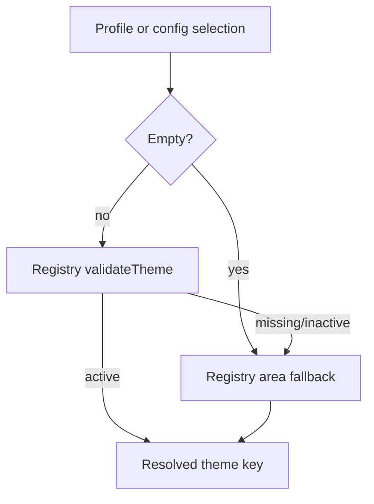

# Runtime theme engine (MC-8A)

How client profile theme selections are validated and resolved at runtime via
the theme registry and `RuntimeThemeManager`. Complements
[runtime-client-branding-theme-resolution.md](runtime-client-branding-theme-resolution.md).

## Scope

MC-8A adds:

- **`config/client_themes.php`** — canonical theme registry per portal area
- **`ClientThemeRegistry`** — read-only registry access
- **`RuntimeThemeManager`** — validated resolution with fallback
- **`ClientThemeResolver`** — backwards-compatible facade (MC-6A API unchanged)
- **Dev CP theme page** — registry visibility + fallback warnings
- **`php artisan ota:client-theme-audit`** — read-only CLI audit

Production layouts (`frontend.blade.php`, dashboard/admin/staff layouts) are **not**
wired to the engine yet — that is MC-8B.

## Theme registry

File: `config/client_themes.php`

Each area (`frontend`, `admin`, `staff`) defines:

| Field | Description |
|-------|-------------|
| `fallback` | Default theme key when selection is empty or invalid |
| `themes` | Map of theme key → theme record |

Each theme record includes: `key`, `name`, `area`, `version`, `status`
(`active` / `inactive`), `asset_base`, nullable `preview_image`, `description`,
`supports` (e.g. `css`, `js`, `layouts`).

Registered themes (MC-8A):

| Area | Themes | Fallback |
|------|--------|----------|
| frontend | `v1-classic`, `v2-modern` | `v1-classic` |
| admin | `default-admin`, `bento-admin` | `default-admin` |
| staff | `default-staff`, `bento-staff` | `default-staff` |

## Client profile theme fields

Stored on `client_profiles`:

| Column | Area |
|--------|------|
| `active_frontend_theme` | Public site |
| `active_admin_theme` | Admin console |
| `active_staff_theme` | Staff portal |
| `asset_profile` | Folder under `public/client-assets/` (unchanged from MC-6A) |

## Resolution priority

Per area, `RuntimeThemeManager` resolves in this order:

1. **Profile DB fields** — via `CurrentClientContext` or explicit `ClientProfile` (Dev CP / audit)
2. **`config('ota_client')`** — `theme`, `admin_theme`, `staff_theme`
3. **Registry fallback** — area default from `config/client_themes.php`

After a raw selection is chosen, the manager validates it with
`ClientThemeRegistry::validateTheme()`. Missing or inactive keys fall back to the
area default and record `used_fallback = true`.



## Public folder mapping

Theme assets live under `public/{asset_base}/` where `asset_base` comes from the
registry (e.g. `themes/frontend/v1-classic`).

`RuntimeThemeManager::themeExists()` requires both registry validation **and** the
directory on disk. Missing directories produce warnings in audit/Dev CP but do not
block resolution.

Client branding assets remain under `public/client-assets/{asset_profile}/` (MC-5A).

## Services

### `App\Services\Client\ClientThemeRegistry`

| Method | Purpose |
|--------|---------|
| `all($area = null)` | All themes, optionally filtered by area |
| `get($key, $area = null)` | Single theme record |
| `exists($key, $area = null)` | Key present in registry |
| `active($area = null)` | Themes with `status === active` |
| `fallback($area)` | Area default key |
| `assetBase($themeKey, $area)` | Relative public path |
| `validateTheme($themeKey, $area)` | Exists and active |

### `App\Services\Client\RuntimeThemeManager`

| Method | Purpose |
|--------|---------|
| `frontend()` / `admin()` / `staff()` | Resolved validated theme key |
| `forArea($area, $profile = null)` | Generic area resolver |
| `assetBase($area, $profile = null)` | Registry asset base for resolved theme |
| `assetUrl($path, $area, $profile = null)` | Full asset URL |
| `themeExists($area, $profile = null)` | Registry valid + on disk |
| `summary($profile = null)` | Per-area selected/resolved/fallback/warnings |

### `App\Services\Client\ClientThemeResolver` (MC-6A API)

Unchanged public methods; delegates theme resolution to `RuntimeThemeManager`.
`assetProfile()` resolution unchanged.

Helper: `client_theme()` → `ClientThemeResolver`.

## Dev CP

`GET /dev/cp/clients/{profile}/theme` shows:

- Available active themes per area from the registry
- Selected vs resolved keys and asset base
- Warning alert when fallback was used or theme folder is missing on disk

The existing theme edit form is unchanged.

## Audit command

```bash
php artisan ota:client-theme-audit --client=haseeb-master
```

Read-only. Outputs client slug, per-area selected/resolved/fallback/registry/on-disk/asset
base, and warnings. Default client: `haseeb-master`.

## MC-8B (next)

MC-8B will wire production and operator layouts to consume `RuntimeThemeManager` /
`client_theme()` for CSS/JS and view selection. MC-8A only establishes the registry
and resolution layer.

## Verification

```bash
php artisan test --filter=ClientThemeRegistryTest
php artisan test --filter=RuntimeThemeManagerTest
php artisan test --filter=ClientThemeResolverTest
php artisan test --filter=OtaClientThemeAuditCommandTest
php artisan test --filter=DevCpClientProfilesTest
php artisan test --filter=OtaRouteSafetyAuditCommandTest
php artisan ota:client-theme-audit --client=haseeb-master
```
