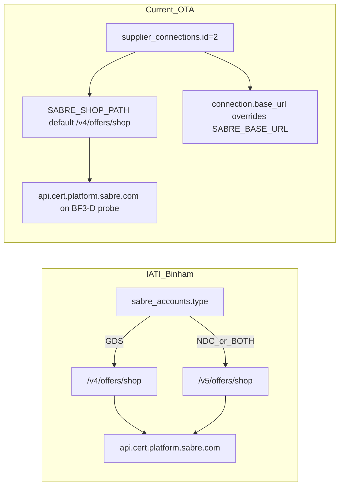

# SABRE-BRANDED-FARES-BF3-E — IATI vs OTA Payload + Connection Diff Audit

**Date:** 2026-06-15  
**Scope:** Audit/diff only — no live Sabre calls, no server upload, no env changes, no runtime payload changes.  
**Prior probe:** BF3-D `iati_full_tis_tpa` on CERT returned HTTP 400 / error `27131`. All four branded variants (`current_tis_tpa`, `root_price_tpa`, `root_optional_qualifiers`, `iati_full_tis_tpa`) failed with the same code.

---

## Executive finding

**OTA `iati_full_tis_tpa` is not a faithful copy of the proven IATI GDS branded-fare shop envelope.** BF3-D copied `BrandedFareIndicators` placement (TIS → PRI → TPA, three keys) but retained OTA-only structural fields and omitted multiple IATI companion blocks present in every successful IATI GDS shop call for LHE→DXB.

**All four OTA branded variants failed with HTTP 400 / `27131`** on `api.cert.platform.sabre.com` + `/v4/offers/shop`. Because even minimal `current_tis_tpa` (two indicator keys only, minimal BFM body) fails, rejection is triggered by **`BrandedFareIndicators` on the OTA connection/PCC** combined with a **non-IATI payload shape** — not placement path alone.

**Recommended next step: D (with C as pre-check).** Align OTA `buildIatiFullBrandedFareShopPayload()` to the proven IATI **GDS v4** skeleton (BF3-F) before any live probe. If the aligned payload still returns `27131` **and** OTA connection 2 PCC differs from IATI’s working PCC, escalate to **C (entitlement)**.

**Do not probe v5/NDC first (option B):** IATI **GDS v4** already returns branded fares for LHE→DXB (HTTP 200, 31 itineraries, 3 brands parsed) in captured debug traffic.

**Parser work (option E)** should proceed only after shop returns HTTP 200.

---

## 1. Redacted IATI payload skeleton (proven GDS v4)

**Scenario:** LHE → DXB, 1 ADT, economy, future date, branded fares enabled.

**Sources:**

| Source | Role |
|--------|------|
| `Binham/Iati_new/modules/flights/sabre/search.php` (lines 537–644) | Builder logic |
| `Binham/Iati_new/uploads/sabre_debug.txt` ACC 2 TYPE:GDS (2026-05-14) | Captured request + HTTP 200 response |

**Endpoint:** `https://api.cert.platform.sabre.com/v4/offers/shop`

```json
{
  "OTA_AirLowFareSearchRQ": {
    "DirectFlightsOnly": false,
    "Version": "4",
    "POS": {
      "Source": [{
        "PseudoCityCode": "***PCC***",
        "RequestorID": {
          "Type": "1",
          "ID": "1",
          "CompanyName": { "Code": "TN" }
        }
      }]
    },
    "OriginDestinationInformation": [{
      "RPH": "1",
      "DepartureDateTime": "2026-07-10T00:00:00",
      "OriginLocation": { "LocationCode": "LHE" },
      "DestinationLocation": { "LocationCode": "DXB" },
      "TPA_Extensions": {
        "SegmentType": { "Code": "O" }
      }
    }],
    "TravelPreferences": {
      "CabinPref": [{ "Cabin": "Y", "PreferLevel": "Preferred" }],
      "TPA_Extensions": {
        "DataSources": {
          "NDC": "Disable",
          "ATPCO": "Enable",
          "LCC": "Enable"
        },
        "XOFares": { "Value": true },
        "JumpCabinLogic": { "Disabled": true },
        "KeepSameCabin": { "Enabled": true }
      }
    },
    "TravelerInfoSummary": {
      "SeatsRequested": [1],
      "AirTravelerAvail": [{
        "PassengerTypeQuantity": [{ "Code": "ADT", "Quantity": 1 }]
      }],
      "PriceRequestInformation": {
        "CurrencyCode": "PKR",
        "TPA_Extensions": {
          "BrandedFareIndicators": {
            "SingleBrandedFare": true,
            "MultipleBrandedFares": true,
            "ReturnBrandAncillaries": true
          }
        }
      }
    },
    "TPA_Extensions": {
      "IntelliSellTransaction": {
        "RequestType": { "Name": "200ITINS" }
      }
    }
  }
}
```

**IATI debug evidence (GDS account, LHE→DXB):** HTTP 200, 31 itineraries, `fareComponentDescs` 45 entries, 3 brands parsed per itinerary (e.g. ECO SAVER / ECO FLEX / ECO FLEXPLUS).

**NDC/BOTH reference (not GDS comparator):** NDC and BOTH accounts use **v5** + `NDCIndicators` + `PreferNDCSourceOnTie`. Debug ACC 1 TYPE:NDC (v5, LHE→DXB) HTTP 200 with 18 itineraries. Debug ACC 1 TYPE:BOTH (v5) HTTP 200.

**Note on IntelliSell:** `search.php` source defaults `100ITINS`; captured debug for GDS used `200ITINS` (deployed variant). Both succeed in IATI.

---

## 2. Redacted OTA `iati_full_tis_tpa` payload skeleton

**Scenario:** Same route/setup (LHE → DXB, 1 ADT, economy).

**Sources:**

| Source | Role |
|--------|------|
| `app/Services/Suppliers/Sabre/Gds/SabreFlightSearchRequestBuilder.php` | `buildIatiFullBrandedFareShopPayload()` (lines 265–333) |
| `tests/Unit/SabreBrandedFaresSearchProbeTest.php` | Unit fixtures + field assertions |

**Endpoint (BF3-D probe):** `api.cert.platform.sabre.com` + `/v4/offers/shop` → HTTP 400 / `27131`

```json
{
  "OTA_AirLowFareSearchRQ": {
    "Version": "4",
    "POS": {
      "Source": [{
        "PseudoCityCode": "***PCC***",
        "RequestorID": {
          "ID": "1",
          "Type": "1",
          "CompanyName": { "Code": "TN" }
        }
      }]
    },
    "OriginDestinationInformation": [{
      "RPH": "1",
      "OriginLocation": {
        "LocationCode": "LHE",
        "CodeContext": "IATA",
        "LocationType": "A"
      },
      "DestinationLocation": {
        "LocationCode": "DXB",
        "CodeContext": "IATA",
        "LocationType": "A"
      },
      "DepartureDateTime": "2026-06-10T00:00:00",
      "DepartureWindow": "00002359",
      "TPA_Extensions": {
        "SegmentType": { "Code": "O" },
        "CabinPref": { "Cabin": "Y", "PreferLevel": "Preferred" }
      }
    }],
    "TravelPreferences": {
      "CabinPref": { "Cabin": "Y", "PreferLevel": "Preferred" },
      "DirectFlightsOnly": false,
      "TPA_Extensions": {
        "DataSources": {
          "ATPCO": "Enable",
          "LCC": "Disable",
          "NDC": "Disable"
        },
        "NumTrips": { "Number": 100 }
      }
    },
    "TravelerInfoSummary": {
      "SeatsRequested": [1],
      "AirTravelerAvail": [{
        "PassengerTypeQuantity": [{ "Code": "ADT", "Quantity": 1 }]
      }],
      "PriceRequestInformation": {
        "CurrencyCode": "USD",
        "TPA_Extensions": {
          "PublicFare": { "Ind": false },
          "BrandedFareIndicators": {
            "SingleBrandedFare": true,
            "MultipleBrandedFares": true,
            "ReturnBrandAncillaries": true
          }
        }
      }
    },
    "Currency": "USD",
    "TPA_Extensions": {
      "IntelliSellTransaction": {
        "RequestType": { "Name": "100ITINS" }
      }
    }
  }
}
```

### Local generation (no live call)

```powershell
# Preview only — set env temporarily for inspect:
# SABRE_BRANDED_FARES_SEARCH_ENABLED=true
# SABRE_BRANDED_FARES_REQUEST_VARIANT=iati_full_tis_tpa
php artisan sabre:inspect-shop-payload --connection=2 --from=LHE --to=DXB --date=2026-06-07
```

```powershell
php artisan test --filter=test_flag_true_iati_full_tis_tpa_includes_iati_companion_fields
```

Unit test passed locally (2026-06-15): 8 assertions on OTA companion fields.

---

## 3. Field-by-field diff matrix

| Field / block | IATI GDS (working) | OTA `iati_full_tis_tpa` | Severity |
|---------------|-------------------|-------------------------|----------|
| Root `DirectFlightsOnly` | `false` at **root** | absent at root; `false` under `TravelPreferences` | **High** |
| `Version` | `"4"` | `"4"` | Match |
| `POS.Source.PseudoCityCode` | `***PCC***` | `***PCC***` (connection 2) | Unknown until PCC compared |
| `RequestorID` Type/ID/CompanyName | `1` / `1` / `TN` | same | Match |
| ODI `RPH` | `"1"` | `"1"` | Match |
| ODI `DepartureDateTime` | `YYYY-MM-DDT00:00:00` | same format | Match |
| `DepartureWindow` | **absent** | `"00002359"` | **Medium** — OTA-only |
| ODI `OriginLocation` / `DestinationLocation` | `LocationCode` only | + `CodeContext: IATA`, `LocationType: A` | **Medium** — OTA-only |
| ODI `TPA_Extensions.SegmentType` | `{Code: O}` | `{Code: O}` | Match |
| ODI `TPA_Extensions.CabinPref` | **absent** | present (`Y`, Preferred) | **Medium** — OTA-only |
| `TravelPreferences.CabinPref` | **array** `[{...}]` | **object** `{...}` | **High** |
| `TravelPreferences.DirectFlightsOnly` | **absent** (root handles it) | `false` | **High** |
| `DataSources.ATPCO` | `Enable` | `Enable` | Match |
| `DataSources.LCC` | **`Enable`** | **`Disable`** | **High** |
| `DataSources.NDC` | `Disable` (GDS) | `Disable` | Match |
| `XOFares` | `{Value: true}` | **absent** | **High** — IATI-only |
| `JumpCabinLogic` | `{Disabled: true}` | **absent** | **High** — IATI-only |
| `KeepSameCabin` | `{Enabled: true}` | **absent** | **High** — IATI-only |
| `NumTrips` | **absent** | `{Number: 100}` | **Medium** — OTA-only |
| `NDCIndicators` | absent (GDS) | absent | Match (GDS comparator) |
| `SeatsRequested` | `[1]` | `[1]` | Match |
| `AirTravelerAvail` / `PassengerTypeQuantity` | ADT×1 | ADT×1 | Match |
| `PriceRequestInformation.CurrencyCode` | `PKR` | `USD` (config default) | **Medium** |
| `PublicFare.Ind` | **absent** | `false` | **Medium** — OTA-only |
| `BrandedFareIndicators` path | TIS→PRI→TPA | TIS→PRI→TPA | Match |
| `BrandedFareIndicators` keys | 3 keys (all `true`) | 3 keys (all `true`) | Match |
| Root `Currency` | **absent** | `"USD"` | **Medium** — OTA-only |
| `IntelliSellTransaction` | `200ITINS` (debug) / `100ITINS` (source) | `100ITINS` (config default) | Low |

### Extra IATI fields missing in OTA (GDS path)

- Root `DirectFlightsOnly`
- `TravelPreferences.TPA_Extensions.XOFares`
- `TravelPreferences.TPA_Extensions.JumpCabinLogic`
- `TravelPreferences.TPA_Extensions.KeepSameCabin`
- `DataSources.LCC: Enable`
- `CabinPref` as **array** under `TravelPreferences`

### OTA fields not in IATI GDS working payload

- `DepartureWindow`
- `CodeContext` / `LocationType` on ODI locations
- ODI-level `CabinPref`
- `TravelPreferences.DirectFlightsOnly` (IATI uses root)
- `NumTrips`
- `PublicFare.Ind`
- Root `Currency`
- `DataSources.LCC: Disable` (IATI uses Enable)

---

## 4. Endpoint / account matrix



| Dimension | IATI / Binham | Current OTA |
|-----------|---------------|-------------|
| **Account model** | Multiple `sabre_accounts` rows; `type` = `GDS` / `NDC` / `BOTH` | Single `supplier_connections` row; **no GDS/NDC/BOTH type field** |
| **Version switching** | `GDS` → v4; `NDC`/`BOTH` → v5 (`search.php` lines 538–540) | Global `SABRE_SHOP_PATH`; `otaAirLowFareSearchVersion()` mirrors path prefix |
| **CERT host** | `https://api.cert.platform.sabre.com` | BF3-D probe: same host; config fallback `https://api-crt.cert.havail.sabre.com` |
| **Shop path** | `/v{v}/offers/shop` per account type | `/v4/offers/shop` (global config) |
| **DataSources (GDS)** | NDC Disable, ATPCO Enable, **LCC Enable** | NDC Disable, ATPCO Enable, **LCC Disable** |
| **DataSources (NDC)** | NDC Enable, ATPCO/LCC Disable | Not implemented (always Disable) |
| **DataSources (BOTH)** | all Enable + `NDCIndicators` | Not implemented |
| **Branded fare dual path** | TIS `BrandedFareIndicators` + `NDCIndicators` (NDC/BOTH) | TIS `BrandedFareIndicators` only |
| **v5 support in OTA** | N/A | Path-configurable (`SABRE_SHOP_PATH=/v5/offers/shop`); not a certified production shop path |
| **Auth** | `V1:{epr}:{pcc}:{domain}` Basic | Same via `SabreClient` (encrypted on connection) |

### Key files

| System | File | Role |
|--------|------|------|
| IATI | `Binham/Iati_new/modules/flights/sabre/search.php` | Shop payload + parallel curl + brand parsing |
| IATI | `Binham/Iati_new/uploads/sabre_debug.txt` | Captured requests/responses |
| OTA | `app/Services/Suppliers/Sabre/Gds/SabreFlightSearchRequestBuilder.php` | `buildIatiFullBrandedFareShopPayload()` |
| OTA | `app/Services/Suppliers/Sabre/Core/SabreClient.php` | `resolveBaseUrl()`, `shopRequestPath()`, `postShopPayload()` |
| OTA | `app/Console/Commands/SabreInspectShopPayloadCommand.php` | Local payload preview |
| OTA | `config/suppliers.php` | `shop_path`, branded-fare flags |

---

## 5. Exact suspected blocker

### Primary: structural envelope drift (option **D**)

OTA `iati_full_tis_tpa` copied `BrandedFareIndicators` but not the IATI GDS companion envelope. Highest-signal mismatches vs proven HTTP 200 payload:

1. **`DataSources.LCC: Disable`** vs IATI **`Enable`**
2. **Missing `XOFares`, `JumpCabinLogic`, `KeepSameCabin`**
3. **`DirectFlightsOnly` at wrong level** (`TravelPreferences` vs root)
4. **`CabinPref` object vs array**
5. **OTA-only extras** (`DepartureWindow`, ODI metadata, `PublicFare`, root `Currency`, `NumTrips`)

### Secondary: PCC entitlement (option **C**)

All four OTA variants — including minimal `current_tis_tpa` with only two indicator keys — returned `27131`. If OTA connection 2 PCC is not the same PCC IATI uses for successful branded GDS shops, entitlement must be ruled in/out before interpreting payload diffs.

**Pre-implementation check (read-only):** Compare connection 2 PCC against IATI working PCC via `sabre:inspect-shop-payload` sanitized output. Redact both as `***PCC***` in reports.

### Not the primary blocker

| Option | Reason |
|--------|--------|
| **A** (single field) | Multiple independent mismatches; one-field fix insufficient |
| **B** (v5/NDC) | IATI GDS v4 already succeeds with branded fares LHE→DXB |
| **E** (parser) | Premature until shop returns HTTP 200 |

---

## 6. Recommended next step (closure rule)

**Do not run another live probe until one targeted implementation pass aligns OTA to IATI GDS skeleton (BF3-F).**

### BF3-F implementation checklist (only if approved)

Update `buildIatiFullBrandedFareShopPayload()` to match IATI GDS v4:

- Move `DirectFlightsOnly` to root; remove from `TravelPreferences`
- Use `CabinPref: [{...}]` array in `TravelPreferences`
- Set `DataSources.LCC: Enable`
- Add `XOFares`, `JumpCabinLogic`, `KeepSameCabin`
- Remove OTA-only fields for this variant: `DepartureWindow`, ODI `CodeContext`/`LocationType`, ODI `CabinPref`, `NumTrips`, `PublicFare`, root `Currency`
- Consider `SABRE_SHOP_CURRENCY=PKR` or request-derived currency
- Default IntelliSell to `200ITINS` to match latest IATI debug (or keep configurable)

### Files to change (implementation only — not this audit pass)

| File | Change |
|------|--------|
| `app/Services/Suppliers/Sabre/Gds/SabreFlightSearchRequestBuilder.php` | Align `buildIatiFullBrandedFareShopPayload()`; gate ODI segment builder for iati_full |
| `tests/Unit/SabreBrandedFaresSearchProbeTest.php` | Update `test_flag_true_iati_full_tis_tpa_includes_iati_companion_fields` |
| `tests/Feature/SabreInspectShopPayloadCommandTest.php` | If inspect output keys change |
| `summary.md` | BF3-F changelog row |

### Verification (local only)

```powershell
php artisan test --filter=SabreBrandedFaresSearchProbeTest
php artisan test --filter=SabreInspectShopPayloadCommandTest
php artisan sabre:inspect-shop-payload --connection=2 --from=LHE --to=DXB --date=2026-06-07
```

### When a live probe is justified

One CERT `--send` with aligned payload **only if**:

- Unit tests pass
- Local inspect skeleton matches IATI GDS matrix above
- PCC parity confirmed or documented

If aligned payload still returns `27131` → **C (PCC branded-fare entitlement)** via Sabre account review, not more variant probing.

---

## Scope compliance

- Audit/diff only — no live Sabre calls, uploads, env changes, or credential exposure
- No checkout/revalidation/AirPrice/PNR/ticketing/payment changes
- Parser work deferred until HTTP 200
