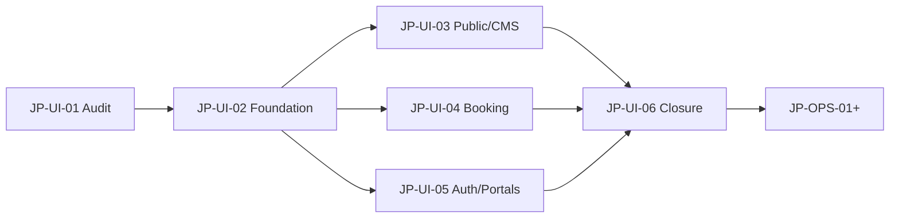

# JP-UI Implementation Roadmap (JP-UI-02 – JP-UI-06 + JP-OPS)

Phase: **JP-UI-01** (evidence source)  
Baseline: `5fad262`

---

## JP-UI-02 — SHARED-DESIGN-SYSTEM-DAY-NIGHT-THEME-TYPOGRAPHY-SHELL-HEADER-FOOTER-IMAGE-SLOTS-AND-FOUNDATION

**Status:** Complete (see `docs/phases/JP-UI-02-*-SUMMARY.md`)

**Objective:** Shared visual foundation before page-level parity work.

### Pages
- All public routes (shell only)
- Checkout shell chrome
- Dashboard shells (token alignment, not full parity)

### Components
- `ThemeProvider`, `ThemeSwitch`
- Tokenized colors (light + dark)
- `SiteHeader` / `SiteFooter` geometry per mockup
- `PublicPageContainer` / `SectionContainer` consolidation
- `ImageSlot`, `EmptyState`, `ErrorState`, `LoadingSkeleton` base
- Typography scale refinement (compact density)

### Dependencies
- JP-UI-01 audit (this phase)
- No Laravel behavior changes

### Backend constraints
- Nav/social may remain static until JP-UI-03 CMS wiring

### Acceptance criteria
- See JP-UI-02 section in `RESPONSIVE-ACCESSIBILITY-AND-VISUAL-ACCEPTANCE-CRITERIA.md`

### Tests
- Theme hydration smoke
- Header/footer Playwright shell tests
- `typecheck`, `lint`, `build`

### Deferred
- Full homepage hero
- Results card redesign

---

## JP-UI-03 — HOMEPAGE-ABOUT-SUPPORT-PUBLIC-CMS-AND-COMPACT-HERO-SEARCH-VISUAL-PARITY

**Status:** Complete (see `docs/phases/JP-UI-03-*-SUMMARY.md`)

**Objective:** Public marketing and CMS pages match mockups #1, #2, #3.

### Pages
- `/`, `/about-us`, `/support`, `/contact`, `/faq`, legal, CMS slugs

### Components
- `HomepageHero` rebuild
- `SearchModule` compact single-row desktop variant
- `DestinationsSection`, `FeaturedOffersSection`, `WhyJetPakistanSection`, `TravelInspirationSection`
- `BenefitStrip`, `SupportCard`, `CMSSectionRenderer`

### Dependencies
- JP-UI-02 tokens and shell

### Backend constraints
- Replace `features/home/fixtures/*` with Laravel public content APIs
- No invented statistics or emergency claims

### Acceptance criteria
- Homepage compact search above fold at 1440×900
- Section order matches mockup #1
- CMS-driven destinations/offers/articles

### Tests
- `homepage.spec.ts`, `public-content.spec.ts`
- Visual capture diff vs JP-UI-01 baseline

### Deferred
- Hotels/Offers nav unless JP-OPS approves routes

---

## JP-UI-03A — DARK-SYSTEM-RESPONSIVE-INTERACTION-STATE-VISUAL-MATRIX-AND-FINAL-PARITY-CLOSURE

**Status:** Complete (see `docs/phases/JP-UI-03A-*-SUMMARY.md`)

**Objective:** Complete JP-UI-03 visual evidence across themes, viewports, zoom, and interaction states; fix evidenced defects only.

### Scope
- 119-scenario visual matrix (`npm run audit:visual:jp-ui-03a`)
- Theme/system/dark/mobile/zoom/interaction captures
- Horizontal overflow + hydration gates
- `ThemeProvider` hydration fix

### Out of scope
- JP-UI-04 booking-flow redesign

### Tests
- `jp-ui-03a-theme-matrix.spec.ts`
- `homepage.spec.ts`, `public-content.spec.ts`, `jp-ui-02-theme.spec.ts` (regression)

---

## JP-UI-04 — FLIGHT-RESULTS-FARE-SELECTION-PASSENGERS-SEATS-REVIEW-PAYMENT-SUCCESS-VISUAL-PARITY

**Status:** Complete (see `docs/phases/JP-UI-04-*-SUMMARY.md`)

**Branch:** `phase/jetpk-ui-04-booking-journey-visual-parity`  
**Baseline:** `5f718c7`

**Objective:** Booking journey family matches mockups #13, #11, #4, #8, #10, #5.

### Pages
- `/flights/results`, return options, `/booking/passengers`, `/booking/review`, `/booking/payment/*`, `/booking/confirmation`

### Components
- `features/booking-layout/` — `BookingPageShell`, `BookingLayout`, `BookingSidebar`, `OrderSummary`, `MobileOrderSummary`, `MobileStickyAction`
- `FlightResultCard`, `ResultsFilterPanel`, `ResultsSortTabs`, enhanced `SearchSummaryBar`
- `BrandedFareCarousel`, `FlightDetailsDrawer`
- `BookingProgress` v2 (shared; skipped-step omission)
- `PassengerDetailsPage`, `BookingReviewPage`, `ManualPaymentPage`, `CardPaymentPage`, `BookingConfirmationPage` — migrated to shared layout
- `SeatMap` — **only if** JP-OPS enables `seat_map_available` (not implemented; step omitted)

### Dependencies
- JP-UI-02 foundation

### Backend constraints
- Progress from Laravel only
- Seats hidden when unsupported
- No fake fares or seat numbers

### Acceptance criteria
- See JP-UI-04 section in acceptance criteria doc
- Match ratings target ≥4 on results and checkout

### Tests
- `npm run audit:visual:jp-ui-04` — 28 scenarios
- `tests/visual-audit/jp-ui-04-booking-journey.visual.spec.ts`
- `flight-results.spec.ts`, `flight-details.spec.ts`, `standard-booking-*.spec.ts` (regression)

### Visual contracts
- `frontend/docs/visual/FLIGHT-RESULTS-*.md` through `BOOKING-PROGRESS-AND-SHARED-CHECKOUT-LAYOUT-CONTRACT.md`
- `frontend/docs/visual/JP-UI-04-MOCKUP-COMPARISON-AND-ACCEPTANCE-REPORT.md`

### Deferred
- Dedicated `/fare-selection` route (optional; may remain inline)
- Seat map UI (conditional future target)
- Success celebration assets (JP-UI-06)

---

## JP-UI-04A — BOOKING-JOURNEY-STATE-MATRIX-AND-FINAL-VISUAL-CLOSURE

**Status:** Complete (see `docs/phases/JP-UI-04A-*-SUMMARY.md`)

**Branch:** `phase/jetpk-ui-04a-booking-state-matrix-closure`  
**Baseline:** `f558844`

**Objective:** Complete 120-scenario visual/state matrix for booking journey; fix defects exposed by matrix.

### Tests
- `npm run audit:visual:jp-ui-04a` — **120** scenarios (mandatory gate)
- `tests/jp-ui-04a-*.spec.ts` (8 targeted spec files)
- JP-UI-04 regression specs

### Evidence
- `frontend/docs/visual/JP-UI-04A-COMPLETE-BOOKING-VISUAL-MATRIX.md`
- `frontend/docs/visual/jp-ui-04a-capture-result.json`

---

## JP-UI-05 — LOGIN-SIGNUP-MANAGE-BOOKING-CUSTOMER-AGENT-AND-DASHBOARD-VISUAL-PARITY

**Status:** Complete (see `docs/phases/JP-UI-05-*-SUMMARY.md`)

**Branch:** `phase/jetpk-ui-05-auth-portals-dashboard-visual-parity`  
**Baseline:** `6d27f9d`

**Objective:** Auth and portal surfaces match mockups #6, #7, #9; customer/agent portal shell parity; dashboard theme bootstrap and token alignment.

### Pages
- `/login`, `/register`, `/agent/register`, `/forgot-password`, `/login/otp`, `/reset-password/[token]`
- `/lookup-booking`
- `/customer/*`, `/agent/*`
- `/admin/dashboard/*`, `/staff/dashboard/*` (dashboard app)

### Components
- `AuthPageShell`, `AuthIllustrationPanel`, `AuthFormCard`, `AuthBenefits`, `LoginSessionNotice`
- `BookingLookupPage` hero band, lookup card, trust chips (Turnstile preserved)
- `frontend/features/portal/` — `PortalShell`, `PortalSidebar`, `PortalTopbar`, `PortalMobileDrawer`
- `CustomerDashboardShell`, `AgentDashboardShell` refactored to portal primitives
- `dashboard/lib/theme/theme-bootstrap-script.ts`, `dashboard-shell` token alignment

### Dependencies
- JP-UI-02 theme and typography
- JP-FE-04 auth/OTP (logic unchanged)
- JP-FE-10 lookup Turnstile

### Backend constraints
- Social login visibility from Laravel only
- OTP logic unchanged
- Lookup Turnstile authoritative
- No fake post-lookup actions
- Agent RBAC from Laravel capabilities

### Acceptance criteria
- See JP-UI-05 section in `RESPONSIVE-ACCESSIBILITY-AND-VISUAL-ACCEPTANCE-CRITERIA.md`
- Match ratings target ≥4 on all families (pending audit run)

### Tests
- `npm run audit:visual:jp-ui-05` — **132** scenarios (112 frontend + 20 dashboard)
- `tests/visual-audit/jp-ui-05-visual-matrix.spec.ts`
- `tests/visual-audit/jp-ui-05-dashboard-visual-matrix.spec.ts`
- `tests/auth.spec.ts`, `booking-lookup-turnstile.spec.ts` (regression)

### Visual contracts
- `frontend/docs/visual/AUTH-LOGIN-OTP-RECOVERY-AND-SESSION-VISUAL-CONTRACT.md`
- `frontend/docs/visual/SIGNUP-ACCOUNT-TYPES-VALIDATION-AND-APPROVAL-VISUAL-CONTRACT.md`
- `frontend/docs/visual/MANAGE-BOOKING-TURNSTILE-LOOKUP-AND-ACTION-ELIGIBILITY-VISUAL-CONTRACT.md`
- `frontend/docs/visual/CUSTOMER-PORTAL-NAVIGATION-BOOKINGS-PROFILE-AND-SUPPORT-VISUAL-CONTRACT.md`
- `frontend/docs/visual/AGENT-AGENT-STAFF-WALLET-LEDGER-DEPOSITS-AND-RBAC-VISUAL-CONTRACT.md`
- `frontend/docs/visual/ADMIN-PLATFORM-STAFF-DASHBOARD-SHELL-RBAC-AND-STATE-VISUAL-CONTRACT.md`
- `frontend/docs/visual/JP-UI-05-COMPLETE-AUTH-PORTAL-DASHBOARD-VISUAL-MATRIX.md`
- `frontend/docs/visual/JP-UI-05-MOCKUP-COMPARISON-AND-ACCEPTANCE-REPORT.md`

### Deferred
- Production auth photograph illustration (JP-UI-06)
- Full dashboard operational feature parity (JP-OPS)
- OAuth provider enablement (JP-OPS)

---

## JP-UI-06 — ASSETS-ANIMATIONS-RESPONSIVE-ACCESSIBILITY-SCREENSHOT-DIFF-AND-FINAL-VISUAL-CLOSURE

**Objective:** Production assets, motion, responsive closure, visual diff gate.

### Scope
- Photo/illustration assets per slot audit
- `AnimatedFlightPath` extensions, success animation
- 320–1440 responsive verification
- Playwright screenshot diff vs JP-UI-01 + mockup geometry
- WCAG contrast dark/light
- Contact sheets and parity sign-off

### Tests
- Full `audit:visual:jp-ui-01` + diff tooling
- Accessibility spot checks
- Reduced-motion suite

### Deferred
- None for public/booking visual closure

---

## JP-OPS-01 onward — Operational Laravel closure

**After UI phases stabilize:**

- Public nav CMS (Hotels/Offers/Services decisions)
- Newsletter, offers API
- Seat map supplier integration
- OAuth providers
- Payment/webhook edge cases
- Route health, queue, email internals
- Dashboard operational completeness

Each JP-OPS phase must reference finalized UI contracts from JP-UI-06.

---

## Dependency graph

